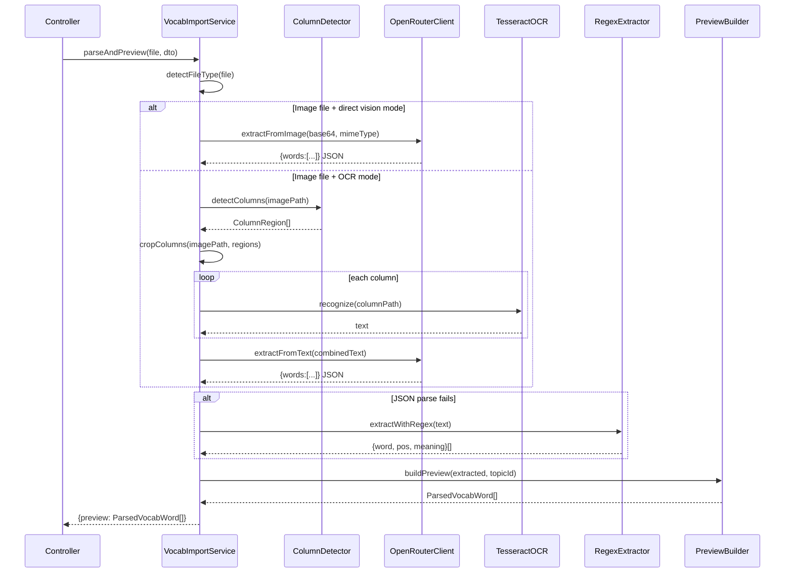

# Design Document: OpenRouter Vision Vocab Import

## Overview

Tính năng này thay thế Gemini 2.0 Flash bằng OpenRouter API trong module nhập từ vựng TOEIC của Teacher Module. Hệ thống hiện tại (`VocabImportService`) sử dụng `@google/generative-ai` trực tiếp — khi Gemini bị quá tải, toàn bộ luồng vision bị gián đoạn. Giải pháp mới giữ nguyên interface công khai (`parseAndPreview`, `confirmImport`) nhưng thay thế lớp AI bằng `OpenRouterClient` — một HTTP client gọi OpenRouter API — đồng thời bổ sung `ColumnDetector` (OpenCV) để cắt ảnh nhiều cột trước khi OCR.

**Luồng xử lý chính:**

```
Upload file
  ├─ Ảnh (JPG/PNG/WEBP/BMP)
  │    ├─ [direct vision mode]  → OpenRouterClient (base64 image) → parse JSON → buildPreview
  │    └─ [OCR-then-AI mode]    → ColumnDetector → cắt cột → Tesseract OCR → OpenRouterClient (text) → parse JSON → buildPreview
  ├─ PDF                        → pdf-parse → OpenRouterClient (text) hoặc regex → buildPreview
  └─ CSV / XLSX / TXT / JSON    → regex extraction → buildPreview

Fallback (mọi bước AI thất bại): Tesseract OCR + regex extraction
```

**Quyết định thiết kế chính:**

- OpenRouter được gọi qua `axios` (đã có trong project) thay vì SDK riêng — tránh thêm dependency.
- `ColumnDetector` dùng `@u4/opencv4nodejs` (Node.js binding cho OpenCV) để phát hiện cột bằng vertical projection profile — không cần Python subprocess.
- Giữ nguyên `ParsedVocabWord` interface và response format của 2 endpoints để đảm bảo backward compatibility.
- Khi `OPENROUTER_API_KEY` không được set, service hoạt động y hệt hệ thống cũ (Tesseract + regex).

---

## Architecture

### High-Level Architecture

```mermaid
graph TD
    FE[Teacher Frontend] -->|POST /teacher/vocab/import/preview| CTRL[VocabImportController]
    CTRL --> SVC[VocabImportService]

    SVC --> FD[FileTypeRouter]
    FD -->|image| CD[ColumnDetector]
    FD -->|pdf| PDF[PdfExtractor]
    FD -->|text files| RX[RegexExtractor]

    CD -->|column images| OCR[TesseractOCR]
    OCR -->|raw text| OR[OpenRouterClient]
    CD -->|direct vision| OR

    PDF -->|raw text| OR
    OR -->|JSON response| DP[JsonParser]
    DP -->|fallback| RX
    RX --> PV[PreviewBuilder]
    DP --> PV

    PV -->|ParsedVocabWord[]| CTRL
    CTRL -->|preview response| FE

    FE -->|POST /teacher/vocab/import/confirm| CTRL2[VocabImportController]
    CTRL2 --> SVC2[VocabImportService.confirmImport]
    SVC2 --> DB[(PostgreSQL via Prisma)]
```

### Component Interaction



---

## Components and Interfaces

### 1. OpenRouterClient

Lớp mới, đóng gói toàn bộ giao tiếp với OpenRouter API.

```typescript
// src/teacher_be/toeic-repository/openrouter.client.ts

export interface OpenRouterConfig {
  apiKey: string;
  modelName: string;
  maxRetries: number;
  retryDelayMs: number;
}

export interface ExtractedWord {
  word: string;
  pos: string;
  meaning: string;
}

export class OpenRouterClient {
  constructor(private readonly config: OpenRouterConfig) {}

  /** Gửi ảnh base64 trực tiếp đến vision model */
  async extractFromImage(
    base64: string,
    mimeType: string,
  ): Promise<ExtractedWord[]>

  /** Gửi text (từ OCR hoặc PDF) đến model để clean/extract */
  async extractFromText(text: string): Promise<ExtractedWord[]>

  /** Validate API key bằng một request nhỏ */
  async validateApiKey(): Promise<boolean>

  private async callApi(messages: OpenRouterMessage[]): Promise<string>
  private parseJsonResponse(raw: string): ExtractedWord[]
  private shouldRetry(error: AxiosError): boolean
}
```

**OpenRouter API Request Format:**

```typescript
// POST https://openrouter.ai/api/v1/chat/completions
{
  model: "google/gemini-flash-1.5-8b",  // từ env OPENROUTER_MODEL_NAME
  messages: [
    {
      role: "user",
      content: [
        { type: "text", text: EXTRACTION_PROMPT },
        // Với vision:
        { type: "image_url", image_url: { url: "data:image/jpeg;base64,..." } }
      ]
    }
  ],
  max_tokens: 4096
}
```

**Headers:**

```
Authorization: Bearer {OPENROUTER_API_KEY}
Content-Type: application/json
HTTP-Referer: https://edvision.app   (optional, for OpenRouter analytics)
X-Title: EdVision Vocab Import       (optional)
```

### 2. ColumnDetector

Module mới sử dụng OpenCV để phát hiện cột trong ảnh.

```typescript
// src/teacher_be/toeic-repository/column-detector.ts

export interface ColumnRegion {
  x: number;
  y: number;
  width: number;
  height: number;
  columnIndex: number;
}

export interface ColumnDetectionResult {
  columns: ColumnRegion[];
  originalWidth: number;
  originalHeight: number;
}

export class ColumnDetector {
  /**
   * Phát hiện cột trong ảnh bằng vertical projection profile.
   * Trả về 1 cột (toàn ảnh) nếu không phát hiện được ranh giới rõ ràng.
   */
  async detectColumns(imagePath: string): Promise<ColumnDetectionResult>

  /**
   * Cắt ảnh gốc thành các ảnh con theo ColumnRegion[].
   * Trả về đường dẫn các file tạm đã tạo.
   */
  async cropToColumns(
    imagePath: string,
    regions: ColumnRegion[],
    outputDir: string,
  ): Promise<string[]>

  /** Resize ảnh nếu vượt quá MAX_DIMENSION (4000px) */
  private async resizeIfNeeded(imagePath: string): Promise<string>
}
```

**Thuật toán phát hiện cột (Vertical Projection Profile):**

```
1. Đọc ảnh → grayscale → threshold (Otsu)
2. Tính vertical projection: sum pixel values theo từng cột x
3. Tìm "valleys" (vùng trắng liên tục) trong projection profile
4. Valley có width ≥ MIN_GAP_WIDTH (20px) → ranh giới cột
5. Nếu tìm được ≥ 1 valley → split thành N+1 cột
6. Nếu không tìm được valley → 1 cột (toàn ảnh)
```

### 3. VocabImportService (refactored)

Giữ nguyên public interface, thay thế Gemini bằng OpenRouterClient.

```typescript
// src/teacher_be/toeic-repository/vocab-import.service.ts

@Injectable()
export class VocabImportService {
  private openRouter: OpenRouterClient | null = null;
  private columnDetector: ColumnDetector;

  constructor(private readonly prisma: PrismaService) {
    this.columnDetector = new ColumnDetector();
    this.initOpenRouter();
  }

  // ── Public interface (không thay đổi) ──────────────────────────────────
  async parseAndPreview(
    file: Express.Multer.File,
    dto: VocabImportPreviewDto,
  ): Promise<{ preview: ParsedVocabWord[]; rawText: string }>

  async confirmImport(dto: ConfirmImportDto): Promise<{ imported: number }>

  async upsertTopic(dto: CreateTopicDto): Promise<VocabTopic>

  async listTopics(certType?: string): Promise<TopicListItem[]>

  async deleteWord(wordId: number): Promise<{ deleted: boolean; wordId: number }>

  // ── Private processing pipeline ────────────────────────────────────────
  private async processImage(file: Express.Multer.File): Promise<ExtractedWord[]>
  private async processPdf(filePath: string): Promise<ExtractedWord[]>
  private async processTextFile(filePath: string): Promise<ExtractedWord[]>
  private async ocrColumns(imagePath: string): Promise<string>
  private buildPreview(extracted: ExtractedWord[], topicId?: number): ParsedVocabWord[]
  private initOpenRouter(): void
}
```

**Xác định processing mode:**

```typescript
private async processImage(file): Promise<ExtractedWord[]> {
  // Direct vision: OpenRouter có vision capability
  if (this.openRouter && this.isVisionModel()) {
    try {
      return await this.openRouter.extractFromImage(base64, mimeType);
    } catch (e) {
      if (isQuotaError(e)) {
        // Fallback sang OCR-then-AI
      }
    }
  }

  // OCR-then-AI: ColumnDetector + Tesseract + OpenRouter text
  const text = await this.ocrColumns(file.path);
  if (this.openRouter) {
    try {
      return await this.openRouter.extractFromText(text);
    } catch {
      // Fallback sang regex
    }
  }

  // Pure fallback: regex only
  return this.extractWithRegex(text);
}
```

### 4. RegexExtractor (tách ra từ VocabImportService)

Tách logic regex thành class riêng để dễ test.

```typescript
// src/teacher_be/toeic-repository/regex-extractor.ts

export class RegexExtractor {
  extract(rawText: string): ExtractedWord[]
  private mergeLines(lines: string[]): string[]
  private parseLine(line: string): ExtractedWord | null
}
```

### 5. PreviewBuilder

Tách logic buildPreview thành class riêng.

```typescript
// src/teacher_be/toeic-repository/preview-builder.ts

export class PreviewBuilder {
  build(extracted: ExtractedWord[], topicId?: number): ParsedVocabWord[]
  classifyTopic(word: string, meaning: string): string
  determineLevel(word: string): string
  normalizePos(raw: string): string
}
```

---

## Data Models

### ParsedVocabWord (không thay đổi)

```typescript
export interface ParsedVocabWord {
  word: string;
  topic_slug: string;
  topic_vi: string;
  topic_en: string;
  level: 'Cơ bản' | 'Trung bình' | 'Nâng cao';
  freq: number;
  definitions: {
    pos: string;
    meaning: string;
    example_en: string;
    example_vi: string;
  }[];
}
```

### ExtractedWord (internal)

```typescript
export interface ExtractedWord {
  word: string;   // lowercase, trimmed
  pos: string;    // normalized: "n." | "v." | "adj." | "adv."
  meaning: string; // Vietnamese meaning, max 250 chars
}
```

### ColumnRegion

```typescript
export interface ColumnRegion {
  x: number;        // pixel offset từ trái
  y: number;        // pixel offset từ trên (thường = 0)
  width: number;    // chiều rộng cột
  height: number;   // chiều cao cột (= chiều cao ảnh gốc)
  columnIndex: number; // 0-based, trái sang phải
}
```

### Database Schema (không thay đổi)

Schema Prisma hiện tại đã đủ. Chỉ cập nhật field `source` trong `VocabWord`:

```prisma
model VocabWord {
  // ... existing fields ...
  source String? @db.VarChar(50)
  // Giá trị mới: "openrouter-vision" | "openrouter-text" | "ocr-regex"
  // Giá trị cũ (backward compat): "gemini-import" | "ocr-upload"
}
```

### Environment Variables

| Variable | Required | Default | Description |
|---|---|---|---|
| `OPENROUTER_API_KEY` | No | — | API key từ openrouter.ai. Nếu không set → fallback Tesseract+regex |
| `OPENROUTER_MODEL_NAME` | No | `google/gemini-flash-1.5-8b` | Model name. Phải hỗ trợ vision nếu dùng direct vision mode |
| `GEMINI_API_KEY` | No | — | Legacy. Nếu có cả hai, OpenRouter được ưu tiên |

---

## API Design

### Endpoints (không thay đổi)

#### POST /teacher/vocab/import/preview

Upload file và nhận preview từ vựng.

**Request:** `multipart/form-data`

| Field | Type | Required | Description |
|---|---|---|---|
| `file` | File | Yes | Ảnh, PDF, hoặc text file. Max 25MB |
| `topic_id` | string (number) | No | ID topic đích. Nếu không có, AI tự phân loại |
| `cert_type` | string | No | `"toeic"` (default) hoặc `"ielts"` |

**Response 200:**

```json
{
  "preview": [
    {
      "word": "abandon",
      "topic_slug": "general-business",
      "topic_vi": "Kinh doanh chung",
      "topic_en": "General Business",
      "level": "Trung bình",
      "freq": 2,
      "definitions": [
        {
          "pos": "v.",
          "meaning": "từ bỏ, bỏ",
          "example_en": "",
          "example_vi": ""
        }
      ]
    }
  ],
  "rawText": ""
}
```

**Response 400:** File không hợp lệ hoặc không extract được từ vựng.

#### POST /teacher/vocab/import/confirm

Lưu danh sách từ vựng đã preview vào database.

**Request Body:** `ConfirmImportDto` (không thay đổi)

**Response 200:**

```json
{ "imported": 42 }
```

#### GET /teacher/vocab/topics

Lấy danh sách chủ đề.

**Query:** `?cert_type=toeic`

**Response 200:** Array of `{ id, slug, titleVI, titleEN, emoji, wordCount }`

---

## Error Handling

### Retry Strategy

```
OpenRouter API Error
├─ 429 (Rate Limit)  → wait 3s → retry (max 2 lần)
├─ 503 (Unavailable) → wait 3s → retry (max 2 lần)
├─ 401 (Unauthorized) → log error, fallback ngay (không retry)
├─ 400 (Bad Request)  → log error, fallback ngay
└─ Network timeout    → wait 3s → retry (max 2 lần)

Sau khi hết retry → fallback sang Tesseract OCR + regex
```

### Fallback Chain

```
Level 1: OpenRouter direct vision
  ↓ (quota/error)
Level 2: OpenRouter text (OCR-then-AI)
  ↓ (quota/error)
Level 3: Tesseract OCR + regex extraction
  ↓ (OCR fails)
Level 4: Throw BadRequestException("Không phân tích được từ vựng")
```

### Error Logging Format

```typescript
// Mỗi lỗi được log với format:
logger.error(`[VocabImport] ${step} failed`, {
  errorCode: e.response?.status ?? 'UNKNOWN',
  message: e.message,
  attempt: currentAttempt,
  fallback: fallbackStrategy,
  processingTimeMs: Date.now() - startTime,
});
```

### JSON Parse Fallback

Khi OpenRouter trả về response không phải JSON thuần:

```typescript
private parseJsonResponse(raw: string): ExtractedWord[] {
  // 1. Strip markdown code fences: ```json ... ```
  // 2. Extract first {...} block với regex
  // 3. JSON.parse
  // 4. Validate words array
  // 5. Nếu bất kỳ bước nào fail → return [] (caller sẽ dùng regex)
}
```

---

## Correctness Properties

*A property is a characteristic or behavior that should hold true across all valid executions of a system — essentially, a formal statement about what the system should do. Properties serve as the bridge between human-readable specifications and machine-verifiable correctness guarantees.*

### Property 1: Column coordinate validity

*For any* image processed by ColumnDetector that returns multiple columns, each ColumnRegion SHALL have non-negative coordinates, non-zero dimensions, and all regions together SHALL not exceed the original image dimensions.

**Validates: Requirements 3.3**

### Property 2: Column ordering invariant

*For any* image with multiple detected columns, the returned ColumnRegion array SHALL be sorted in ascending order of `x` coordinate (left-to-right).

**Validates: Requirements 4.3**

### Property 3: Image crop pixel fidelity

*For any* image and any valid ColumnRegion within that image, the pixel values in the cropped sub-image SHALL exactly match the corresponding pixels in the original image at the same coordinates.

**Validates: Requirements 4.4**

### Property 4: Column filename format

*For any* original filename and column index, the generated temp filename SHALL match the pattern `{basename}_col_{index}{ext}` where `basename` is the filename without extension and `ext` is the original extension.

**Validates: Requirements 4.2**

### Property 5: OCR text concatenation completeness

*For any* set of N column texts, the concatenated result SHALL contain all N column texts as substrings, in left-to-right order.

**Validates: Requirements 5.4**

### Property 6: OCR partial failure resilience

*For any* set of N columns where K columns fail OCR (0 ≤ K < N), the system SHALL still return text from the remaining N-K columns without throwing an exception.

**Validates: Requirements 5.5**

### Property 7: Base64 image encoding round-trip

*For any* image file bytes, encoding to base64 and then decoding SHALL produce bytes identical to the original.

**Validates: Requirements 6.3**

### Property 8: JSON response parsing validity

*For any* valid JSON string matching the schema `{"words":[{"word":string,"pos":string,"meaning":string}]}`, parsing SHALL produce an array where every entry has a non-empty `word` starting with a letter, a non-empty `meaning`, and a normalized `pos`.

**Validates: Requirements 7.3**

### Property 9: Invalid JSON triggers regex fallback

*For any* string that is not valid JSON (or valid JSON that does not match the expected schema), `parseJsonResponse` SHALL return an empty array, causing the caller to invoke `extractWithRegex`.

**Validates: Requirements 7.4, 9.4**

### Property 10: Deduplication by word field

*For any* list of ExtractedWord entries that contains duplicate `word` values, `buildPreview` SHALL return a list where each `word` value appears exactly once (first occurrence wins).

**Validates: Requirements 7.5**

### Property 11: Retry count and delay on transient errors

*For any* sequence of 429 or 503 responses from OpenRouter, the client SHALL retry at most 2 times with a delay of ≥ 3000ms between attempts before giving up and triggering the fallback.

**Validates: Requirements 9.1, 9.2**

### Property 12: Exhausted retries trigger fallback

*For any* scenario where all retry attempts are exhausted (OpenRouter returns errors on all attempts), the system SHALL invoke `extractWithRegex` and SHALL NOT throw an unhandled exception.

**Validates: Requirements 9.3**

### Property 13: Preview completeness

*For any* ExtractedWord entry, `buildPreview` SHALL produce a ParsedVocabWord with all required fields populated: `word`, `topic_slug`, `topic_vi`, `topic_en`, `level`, `freq`, and at least one entry in `definitions`.

**Validates: Requirements 10.1, 10.5**

### Property 14: Topic classification always returns valid topic

*For any* word and meaning string, `classifyTopic` SHALL return a slug that is one of the 10 predefined TOEIC topic slugs.

**Validates: Requirements 10.2**

### Property 15: Level assignment follows word-length rule

*For any* word string of length L, `determineLevel` SHALL return:
- `"Cơ bản"` if L ≤ 6
- `"Trung bình"` if 7 ≤ L ≤ 11
- `"Nâng cao"` if L > 11

**Validates: Requirements 10.3**

### Property 16: POS normalization produces valid output

*For any* raw POS string, `normalizePos` SHALL return a string that ends with `"."` and has length ≤ 8 characters.

**Validates: Requirements 10.4**

### Property 17: Text truncation at 8000 characters

*For any* text string of length N, the text sent to OpenRouter API SHALL have length min(N, 8000).

**Validates: Requirements 12.4**

### Property 18: Image resize respects max dimension

*For any* image with width W or height H where max(W, H) > 4000, after resizing both width and height SHALL be ≤ 4000 pixels, and the aspect ratio SHALL be preserved (ratio error < 0.01).

**Validates: Requirements 12.5**

---

## Testing Strategy

### Dual Testing Approach

Unit tests cover specific examples, edge cases, and error conditions. Property tests verify universal behaviors across all inputs. Both are necessary for comprehensive coverage.

### Property-Based Testing Library

**Library:** `fast-check` (TypeScript-native, well-maintained, works with Jest)

```bash
npm install --save-dev fast-check
```

Each property test runs minimum **100 iterations** (fast-check default). Tag format:

```typescript
// Feature: openrouter-vision-vocab-import, Property {N}: {property_text}
```

### Unit Tests

**OpenRouterClient:**
- Verify correct HTTP headers are sent (Authorization, Content-Type)
- Verify base64 image is included in request body for vision calls
- Verify text is truncated to 8000 chars before sending
- Verify 401/400 errors do not trigger retry
- Verify markdown code fences are stripped from response

**ColumnDetector:**
- Single-column image → returns 1 region covering full width
- Two-column image with clear gap → returns 2 regions
- Image > 4000px → resized before processing
- Temp files are deleted after cropToColumns

**VocabImportService:**
- Image file with OpenRouter configured → uses direct vision path
- Image file without OpenRouter → uses Tesseract path
- PDF file → uses pdf-parse then OpenRouter/regex
- CSV/TXT/JSON → uses regex directly
- File > 25MB → rejected by multer before reaching service

**PreviewBuilder:**
- Empty extracted list → returns empty array
- Entry with word length 6 → level "Cơ bản"
- Entry with word length 7 → level "Trung bình"
- Entry with word length 12 → level "Nâng cao"
- Duplicate words → only first occurrence kept

### Property Tests

```typescript
import fc from 'fast-check';

// Feature: openrouter-vision-vocab-import, Property 10: Deduplication by word field
it('deduplication keeps first occurrence of each word', () => {
  fc.assert(fc.property(
    fc.array(fc.record({
      word: fc.string({ minLength: 2, maxLength: 45 }).filter(w => /^[a-z]/i.test(w)),
      pos: fc.constantFrom('n.', 'v.', 'adj.', 'adv.'),
      meaning: fc.string({ minLength: 2, maxLength: 100 }),
    }), { minLength: 1, maxLength: 50 }),
    (entries) => {
      const result = previewBuilder.build(entries);
      const words = result.map(r => r.word);
      return words.length === new Set(words).size;
    }
  ), { numRuns: 100 });
});

// Feature: openrouter-vision-vocab-import, Property 14: Topic classification always returns valid topic
it('classifyTopic always returns a valid TOEIC topic slug', () => {
  const validSlugs = new Set(TOEIC_TOPICS.map(t => t.slug));
  fc.assert(fc.property(
    fc.string(), fc.string(),
    (word, meaning) => validSlugs.has(previewBuilder.classifyTopic(word, meaning))
  ), { numRuns: 100 });
});

// Feature: openrouter-vision-vocab-import, Property 15: Level assignment follows word-length rule
it('determineLevel follows word-length rule exactly', () => {
  fc.assert(fc.property(
    fc.string({ minLength: 1, maxLength: 50 }),
    (word) => {
      const level = previewBuilder.determineLevel(word);
      if (word.length <= 6) return level === 'Cơ bản';
      if (word.length <= 11) return level === 'Trung bình';
      return level === 'Nâng cao';
    }
  ), { numRuns: 100 });
});

// Feature: openrouter-vision-vocab-import, Property 17: Text truncation at 8000 characters
it('text sent to OpenRouter never exceeds 8000 chars', () => {
  fc.assert(fc.property(
    fc.string({ maxLength: 20000 }),
    (text) => {
      const truncated = text.slice(0, 8000);
      return truncated.length <= 8000;
    }
  ), { numRuns: 100 });
});

// Feature: openrouter-vision-vocab-import, Property 16: POS normalization produces valid output
it('normalizePos always returns string ending with dot, length <= 8', () => {
  fc.assert(fc.property(
    fc.string({ maxLength: 20 }),
    (raw) => {
      const result = normalizePos(raw);
      return result.endsWith('.') && result.length <= 8;
    }
  ), { numRuns: 100 });
});

// Feature: openrouter-vision-vocab-import, Property 9: Invalid JSON triggers regex fallback
it('parseJsonResponse returns empty array for any non-schema-conforming input', () => {
  fc.assert(fc.property(
    fc.oneof(
      fc.string().filter(s => { try { JSON.parse(s); return false; } catch { return true; } }),
      fc.constant('{"notWords": []}'),
      fc.constant('null'),
      fc.constant('[]'),
    ),
    (input) => {
      const result = openRouterClient.parseJsonResponse(input);
      return Array.isArray(result) && result.length === 0;
    }
  ), { numRuns: 100 });
});
```

### Integration Tests

- OpenRouter API key validation on service startup (mocked HTTP)
- Full pipeline: image upload → column detection → OCR → OpenRouter → preview (mocked OpenRouter)
- Fallback pipeline: image upload → OpenRouter 429 → retry → retry → Tesseract + regex
- `confirmImport`: verify words are upserted correctly in database (test DB)

### Test File Structure

```
ed_vision_backend/src/teacher_be/toeic-repository/
├── __tests__/
│   ├── openrouter-client.spec.ts       # Unit + property tests
│   ├── column-detector.spec.ts         # Unit tests
│   ├── regex-extractor.spec.ts         # Unit + property tests
│   ├── preview-builder.spec.ts         # Unit + property tests
│   └── vocab-import.service.spec.ts    # Integration tests (mocked deps)
```
